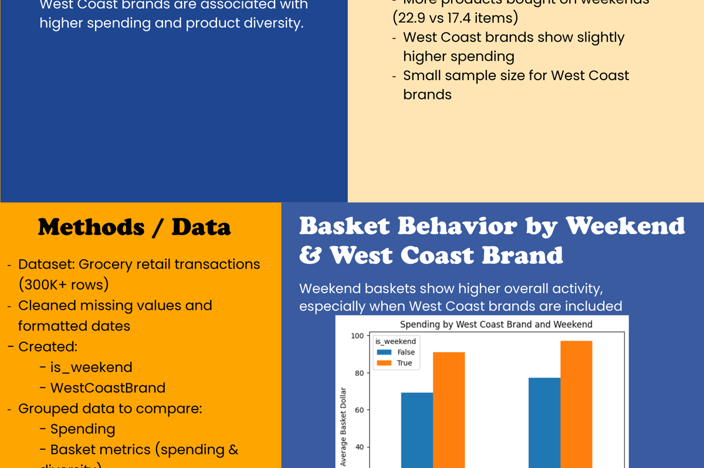

# Portfolio Architecture Guide: Governance & Maintainability Framework

## Overview

This document defines the **semantic, structural, and deployment governance** for the portfolio system. It establishes principles for:

- Architectural integrity (featured/supporting hierarchy)
- Semantic consistency (project mappings, relationships)
- Deployment safety (asset synchronization, atomic commits)
- Maintainability (documentation-first refinement)
- Recruiter-facing curation (hero visual philosophy)
- AI-assisted refinement workflows

**Audience**: Future maintainers, AI assistants, contributing developers, and recruiters reviewing portfolio architecture.

---

## Part 1: Portfolio Architecture Overview

### The Two-Tier Project System

The portfolio organizes projects into two distinct tiers with intentional governance:

#### **Featured Tier** (Recruiter-Facing Heroes)
```
Location: assets/featured/
Display: projects.html (featured reel, index.html hero collage)
Purpose: Curated flagship work (9 projects maximum)
Criteria: Strongest implementation proof-points, highest recruiter impact
Visual Treatment: 260px height, tight hero crops (3:2 aspect ratio)
Philosophy: "Product launch moments, not document previews"
```

**Currently Featured**:
1. Protein AI Pipeline
2. Opioid Prescribing Risk Analysis
3. Grocery Retail Consumer Analytics
4. Minesweeper Game
5. Battleship Game
6. HTML Resume Portfolio
7. AI Caption Generator
8. GAN Discord Bot
9. Data Collaboration Room Studio

#### **Supporting Tier** (Archive/Context)
```
Location: assets/supporting/
Display: projects.html (supporting reel, complete archive)
Purpose: Secondary work, exercises, design/media pieces, learning projects
Criteria: Implementation work, design studies, experiments
Visual Treatment: 204px height, grid display, contextual information
Philosophy: "Learning journey and breadth of work"
```

### Separation Rationale

- **Featured** = what you lead with to recruiters
- **Supporting** = context for technical depth, breadth, and learning trajectory
- **Archive** = complete work inventory for discoverable archives
- **Deployment Safety**: Never move projects between tiers without re-verification

---

## Part 2: Hero Thumbnail Philosophy

### The Focal Positioning System

**Core Principle**: Thumbnails are curated hero moments, not scaled document previews.

#### Why This Matters

```
Generic Scaling (WRONG):
  Full poster (3300×5100 px)
  → scaled to 260px display height
  → becomes 170px wide
  → dashboard becomes invisible spec
  → recruiter sees: solid color block

Curated Hero Crop (CORRECT):
  Dashboard region extracted as a landscape crop
  → displayed at 260px height
  → dashboard readable and prominent
  → proof-point immediately visible
  → recruiter sees: clear analytics capability
```

#### Project-Specific Focal Regions

Each featured project has an intentional crop anchor:

| Project | Focal Region | object-position | Proof-Point |
|---------|--------------|-----------------|------------|
| Protein AI | Derived poster crop | center | AI research methodology |
| Opioid | Derived chart/key findings crop | center | Data visualization capability |
| Grocery | Derived methods/dashboard crop | center | Analytics & insight synthesis |
| Minesweeper | Game board | center center | Game logic & interaction |
| Battleship | Game board with state | center center | OOP & game systems |
| HTML Resume | Hero section + reel | center center | Web design & layout |
| AI Caption | Results panel | center 55% | Working app & AI integration |
| GAN Bot | Generated image | center 60% | AI output & bot interaction |
| Data Collab | Logo system | center center | Design system coherence |

#### CSS Implementation

```css
/* Project-specific focal positioning classes */
.thumb.protein-ai-thumb { object-position: center; }
.thumb.opioid-thumb { object-position: center; }
.thumb.grocery-thumb { object-position: center; }
.thumb.ai-caption-thumb { object-position: center 55%; }
```

**When to Update**: Only when replacing hero PNG with new source asset. The object-position value defines the intended focal region; changing it requires re-verification that the proof-point remains visible.

---

## Part 3: Deployment-Safe Workflows

### Asset Synchronization Rules

#### **Never Update JSON Before Files Exist**

```
WRONG (causes placeholder drift):
1. Update thumbnail-map.json to reference new hero filenames
2. Wait to export actual PNGs
3. Result: JSON points to missing files → broken image references

CORRECT (atomic workflow):
1. Export or crop the specific replacement image into images/thumbnails/
2. Verify it locally at card scale
3. Update thumbnail-map.json with the verified filename
4. Commit the image and metadata together
```

#### **Atomic Commit Strategy**

```bash
# ATOMIC DEPLOYMENT (correct)
git add images/thumbnails/*-hero.png thumbnail-map.json
git commit -m "Add hero thumbnail crops and update thumbnail-map"
git push origin main

# NOT incremental updates:
git add images/thumbnails/new-project-hero.png  # DON'T commit alone
git add thumbnail-map.json                   # DON'T commit alone
```

**Rationale**: CSS class references hero filenames. If PNG missing but JSON updated, system breaks. Atomic commits ensure consistency.

### Verification Checklist

Before deploying any asset changes:

- [ ] All hero PNG files placed in `images/thumbnails/`
- [ ] Each PNG is a landscape crop that reads well at card size
- [ ] Each PNG displays readably at 260px height (test in browser DevTools)
- [ ] File size is reasonable for static deployment
- [ ] No broken image references in JSON or HTML
- [ ] Featured reel displays correct hero visuals (not full posters or CSS fallbacks)
- [ ] Focal positioning working correctly (CSS class applied, object-position applied)
- [ ] Supporting reel unaffected (still using existing fallback system)
- [ ] Hero collage on index.html displays correctly
- [ ] Live deployment verified at christopherdsbarker.github.io

---

## Part 4: Semantic Integrity Governance

### Featured Project Mappings

**Canonical Source**: `thumbnail-map.json` (`featured` section)

Each featured project entry includes:

```json
{
  "project-id": {
    "title": "Display Name",
    "thumbnail": "images/thumbnails/hero-filename.png",
    "source_asset": "original source or export description",
    "status": "artifact|derived|fallback",
    "dimensions": "1600x1067",
    "fallback_visual": "css-class-name"
  }
}
```

**Never**:
- Invent missing featured projects
- Flatten featured/supporting hierarchy
- Duplicate project entries across tiers
- Leave entries without source documentation

**Always**:
- Document source asset location
- Maintain 1:1 mapping to filesystem
- Preserve tier separation (featured ≠ supporting)
- Update JSON atomically with asset changes

### Project Directory Alignment

Featured projects must exist in both:

1. **`assets/featured/{project-id}/`** — Source files
2. **`thumbnail-map.json` → `featured` section** — Metadata
3. **`projects.html` featured reel** — Display reference
4. **`index.html` hero collage** — Promotional display

Missing any of these breaks semantic integrity.

### Deployment-Safe Asset References

Always use **relative paths** for asset references:

```html
<!-- CORRECT: Relative paths -->



<!-- WRONG: Absolute paths (breaks in different environments) -->


```

---

## Part 5: Hero Thumbnail Export Framework

Use `thumbnail-curation-architecture.md` as the canonical priority list. The
current maturity step is selective replacement, not a complete 9-export program.

### Current Highest-ROI Replacements

1. **AI Caption Generator**: replace CSS fallback with a real app screenshot
   showing upload plus generated caption output.
2. **Branding master board**: replace the Data Collaboration Room logo crop only
   if a stronger system board exists.
3. **Gameplay screenshot**: replace CSS game covers only when a real playable
   capture is available.
4. **Protein/Grocery/Opioid refinements**: update only if a new crop clearly
   reads better than the current derived thumbnail.

### Export Rule

For each replacement:

- use a repo-owned or project-owned source artifact
- crop to a landscape hero moment
- place the final PNG under `images/thumbnails/`
- update `thumbnail-map.json` only after the file exists
- commit image and metadata together

---

## Part 6: Maintainability & Documentation Philosophy

### Documentation-First Approach

**Before making changes**, document your intent:

1. **What** are you changing? (specific files/assets)
2. **Why** are you changing it? (architectural reason, recruiter impact)
3. **How** will you validate it? (local verification steps)
4. **Where** is the related documentation? (existing governance files)

### Architectural Comments in Code

Each major system should have comments explaining:

- **Purpose**: Why does this component exist?
- **Intent**: What is the intended user experience?
- **Workflow**: How does this integrate with other systems?
- **Maintenance**: How should this be updated in the future?

**Example** (from `css/styles.css`):

```css
/* ─── THUMBNAIL CURATION ARCHITECTURE ───
   Project-aware focal positioning system: each featured project thumbnail
   intentionally crops to highlight strongest implementation moment.
   
   Philosophy: posters, dashboards, diagrams, UI screenshots are NOT generic
   images to be center-cropped. Each has intentional:
   - hero visual (proof-point)
   - focal crop (visual hierarchy)
   - focal positioning (object-position anchor)
   
   See thumbnail-curation-architecture.md for complete system design.
*/
```

### When to Update Documentation

Update these files when:

| Change Type | Files to Update |
|-------------|-----------------|
| New featured project | `thumbnail-map.json`, `projects.html`, `PORTFOLIO_ARCHITECTURE_GUIDE.md` |
| Hero thumbnail replacement | `thumbnail-map.json`, `thumbnail-curation-architecture.md` if priorities or rules change |
| CSS focal positioning change | `css/styles.css`, `thumbnail-curation-architecture.md` |
| Export workflow refinement | `thumbnail-curation-architecture.md`, `thumbnail-map-doc.md` |
| Semantic hierarchy change | `portfolio-content-map.md`, architecture guide |

**Never**: Update code without updating related documentation.

---

## Part 7: AI-Assisted Refinement Workflows

### For AI Assistants & Contributing Developers

Before implementing changes:

1. **Read Governance Documents**:
   - `PORTFOLIO_ARCHITECTURE_GUIDE.md` (this file)
   - `thumbnail-curation-architecture.md` (thumbnail priorities and crop rules)
   - `thumbnail-map-doc.md` (export workflow)

2. **Identify Constraints**:
   - Featured tier: 9 projects maximum
   - Hero crops: landscape, proof-point-first visuals
   - Atomic deployments: never partial updates
   - Semantic integrity: JSON ↔ filesystem ↔ HTML in sync

3. **Plan Changes**:
   - Document current state
   - Identify architectural implications
   - Propose minimal-diff changes
   - Explain recruiter impact
   - Wait for approval before execution

4. **Validate Deployments**:
   - Verify all asset files exist
   - Check no broken image references
   - Test at 260px display height
   - Confirm focal positioning working
   - Validate local before pushing

### Anti-Hallucination Rules

**Never**:
- Invent missing featured projects
- Create placeholder hero crops (use CSS fallback instead)
- Update JSON before verifying files exist
- Mix featured and supporting tier projects
- Fabricate source asset descriptions
- Change focal positioning without recruiter impact analysis

**Always**:
- Verify featured project mappings in `thumbnail-map.json`
- Document source asset locations
- Test changes locally at localhost:8003
- Use atomic commits (no partial updates)
- Preserve existing tier separation

---

## Part 8: Recruiter-Facing Curation Principles

### Featured Reel Strategy

The featured reel is the **first impression**. Curation principles:

1. **Visual Energy**: Mix of game boards, dashboards, diagrams, interfaces
2. **Proof-Points**: Each thumbnail immediately communicates capability
3. **Hierarchy**: Strongest projects front and center
4. **Variety**: Different project types prevent monotony
5. **No Whitespace**: Hero crops remove document margins

### Current Order (Intentional)

```
1. Protein AI Pipeline       → AI research credibility
2. Opioid Analysis          → Data visualization capability
3. Grocery Analytics        → Consumer insights synthesis
4. Minesweeper              → Interactive game development
5. Battleship               → OOP & game systems
6. HTML Resume              → Web design & layout
7. AI Caption Generator     → AI integration & working apps
8. GAN Discord Bot          → Bot development & AI generation
9. Data Collab Room Studio  → Design system & studio work
```

**When Reordering**: Only if recruiter feedback or competitive analysis suggests stronger order. Always re-verify focal positioning after reordering.

### Supporting Reel Strategy

Supporting projects organized by:

1. **Category** (design, data, code, media)
2. **Implementation Depth** (learning projects, exercises, studies)
3. **Chronological** (newer work more visible)

**Goal**: Demonstrate breadth, learning trajectory, and technical depth without overwhelming primary reel.

---

## Part 9: Frontend/Backend Alignment

### HTML Structure Governance

**Featured Project Card** (`projects.html`):

```html
<a class="project-card" href="featured/{project-id}.html">
  
  <div class="project-body">
    <h3>{Project Title}</h3>
    <p>{Brief description}</p>
    <ul class="tag-list">
      <li>{tag1}</li>
      <li>{tag2}</li>
    </ul>
  </div>
</a>
```

**CSS Classes Required**:
- `.project-card` — base container
- `.thumb` — image container
- `.{project-id}-thumb` — focal positioning class
- `.project-body` — metadata section
- `.tag-list` — technology tags

**When Adding Project**: Ensure all classes and links are in place.

### CSS Architecture Governance

**Focal Positioning Classes** — defined in `css/styles.css`:

```css
.thumb.{project-id}-thumb {
  object-position: {vertical-anchor};
}
```

Must exist for every featured project. If hero PNG deployed without CSS class, focal positioning doesn't work.

**CSS Fallback Visuals** — defined for projects without PNG:

```css
.visual-thumb.{fallback-type} {
  background: /* gradient + pattern */;
}
```

Allows graceful fallback while awaiting hero PNG export.

### JSON Metadata Governance

**`thumbnail-map.json` featured section**:

```json
{
  "{project-id}": {
    "title": "{display name}",
    "thumbnail": "images/thumbnails/{project-id}-hero.png",
    "source_asset": "{source or export description}",
    "status": "artifact|derived|fallback",
    "dimensions": "1600x1067"
  }
}
```

**When to Update**:
- New hero PNG deployed: update `thumbnail` path
- Status changes (fallback → artifact): update `status`
- Asset moved/renamed: update `source_asset`
- Metadata changes: update corresponding field

**Never**: Leave entries out of sync with filesystem or CSS.

---

## Part 10: Audit System Philosophy

### Governance Audit Files

The portfolio maintains several audit documents:

| File | Purpose | Update Frequency |
|------|---------|------------------|
| `portfolio-parity-audit.md` | Verify resume claims match project pages | Per major update |
| `portfolio-no-hallucination-audit.md` | Catch semantic inconsistencies | Per significant change |
| `portfolio-thumbnail-audit.md` | Verify thumbnail specs and quality | Per export batch |
| `portfolio-sync-report.md` | Track asset synchronization | Per deployment |

### When to Run Audits

- Before featuring new project
- Before major thumbnail overhaul
- After changing semantic organization
- Before recruiting season deployments

### Audit Workflow

```
1. Identify changes made
2. Run relevant audits
3. Document findings
4. Resolve inconsistencies
5. Re-run to verify fix
6. Commit with audit results
```

---

## Part 11: Common Maintenance Tasks

### Add a New Featured Project

1. **Create project source** in `assets/featured/{project-id}/`
2. **Create hero thumbnail** in `images/thumbnails/{project-id}-hero.png`
3. **Add CSS focal class** to `css/styles.css`:
   ```css
   .thumb.{project-id}-thumb { object-position: {anchor}; }
   ```
4. **Add HTML card** to `projects.html` featured reel
5. **Add JSON entry** to `thumbnail-map.json` featured section
6. **Create project page** in `featured/{project-id}.html`
7. **Run parity audit** to verify resume/page alignment
8. **Verify locally** at localhost:8003
9. **Atomic commit** (all changes together)

### Replace a Hero Thumbnail

1. **Export new PNG** to `images/thumbnails/{project-id}-hero.png`
2. **Verify focal positioning** at 260px display height
3. **Atomic commit** (only the PNG file change)
4. **No JSON/CSS changes needed** (metadata already in place)

### Reorder Featured Reel

1. **Update HTML** in `projects.html` featured section (move card order)
2. **Re-verify focal positioning** for new display context
3. **Test locally** to ensure visual flow still works
4. **Single commit** with reorder explanation

### Update Focal Positioning

1. **Identify new focal region** (where proof-point should be)
2. **Calculate object-position value** (horizontal center, vertical %)
3. **Update CSS** class in `css/styles.css`
4. **Verify locally** that proof-point now visible
5. **Document rationale** in commit message

---

## Part 12: Deployment Checklist

### Before Pushing to origin/main

**Asset Integrity**:
- [ ] Newly referenced hero PNGs exist in `images/thumbnails/`
- [ ] New images use a landscape crop that reads at card scale
- [ ] New images are reasonably optimized for static deployment
- [ ] No broken image references

**Code Integrity**:
- [ ] All CSS focal classes defined for featured projects
- [ ] All HTML cards properly structured
- [ ] All JSON entries match filesystem
- [ ] No unused/orphaned files

**Deployment Safety**:
- [ ] Atomic commit (all related changes together)
- [ ] Clear commit message (what changed, why)
- [ ] Verified locally at localhost:8003
- [ ] No partial/incremental updates

**Verification**:
- [ ] Featured reel displays intended image or fallback visuals
- [ ] Focal positioning working correctly
- [ ] No console errors
- [ ] Supporting reel unaffected
- [ ] Hero collage on homepage displays correctly

### After Pushing to origin/main

**Live Verification**:
- [ ] Wait 1–2 minutes for GitHub Pages rebuild
- [ ] Verify christopherdsbarker.github.io loads
- [ ] Featured reel displays hero visuals (not posters)
- [ ] All images load without broken references
- [ ] Focal positioning visible

**If Issues Found**:
1. Don't push additional fixes immediately
2. Run relevant audits
3. Document issues
4. Plan minimal-diff rollback or fix
5. Test locally before pushing fix

---

## Part 13: Future Enhancement Guidelines

### Proposed Future Improvements

#### Dynamic Hero Crop Generation
```
Goal: Auto-generate hero crops from source posters using ML crop detection
Constraint: Must remain deployment-safe (verify all crops before deploy)
Impact: Reduce manual export time
```

#### Project-Specific CSS Themes
```
Goal: Custom color/style per featured project category
Constraint: Maintain consistent focal positioning architecture
Impact: Visual differentiation without breaking semantic structure
```

#### Semantic Search Integration
```
Goal: Help recruiters find projects by skill/technology
Constraint: Must preserve featured/supporting tier semantics
Impact: Better discoverability without changing core structure
```

#### Resume Evidence Linking
```
Goal: Auto-link resume claims to project pages
Constraint: Maintain parity audit (no hallucinated links)
Impact: Stronger proof-point connectivity
```

### When Adding New Features

1. **Maintain Tier Separation**: Don't flatten featured/supporting
2. **Preserve Focal Positioning**: Hero crops remain landscape, proof-point-first assets
3. **Keep Atomic Deployments**: No partial updates
4. **Document Sparingly**: Update canonical docs only when guidance is reusable
5. **Run Audits**: Verify no new inconsistencies

---

## Part 14: Governance Authority & Decision Making

### When Changes Are Needed

**Decide based on**:
1. Recruiter feedback (impact on first impression)
2. Technical debt (maintainability concerns)
3. Semantic inconsistency (parity audits reveal misalignment)
4. Asset quality (hero crops unreadable, proof-points invisible)
5. Tier integrity (featured/supporting boundaries weakening)

**Before implementing**:
1. Document rationale
2. Identify architectural implications
3. Plan minimal-diff approach
4. Verify no breaking changes
5. Run audits

### Conflict Resolution

**If changes conflict with governance**:

- Preserve **featured/supporting tier separation** (highest priority)
- Preserve **atomic deployment strategy** (prevents broken states)
- Preserve **semantic consistency** (JSON ↔ filesystem ↔ HTML alignment)
- Allow flexibility in **hero crop content** (different projects, different approaches)
- Allow flexibility in **focal positioning values** (project-specific needs)

---

## Conclusion

This architecture guide ensures that the portfolio system remains:

- **Semantically Consistent**: Featured/supporting tiers properly separated
- **Deployment-Safe**: Atomic commits prevent broken image references
- **Maintainable**: Documentation-first approach enables future refinement
- **Recruiter-Facing**: Curation principles prioritize first impression
- **Extensible**: Governance framework supports future enhancements

All future changes should align with these principles and update relevant documentation atomically.

For questions about specific maintenance tasks, refer to:
- `thumbnail-curation-architecture.md` — Thumbnail priorities, crop rules, and focal positioning
- `thumbnail-map-doc.md` — Asset workflow
- `portfolio-content-map.md` — Semantic organization
- `portfolio-sync-report.md` — Current state documentation

**Governance takes priority over speed. Maintainability takes priority over features.**
