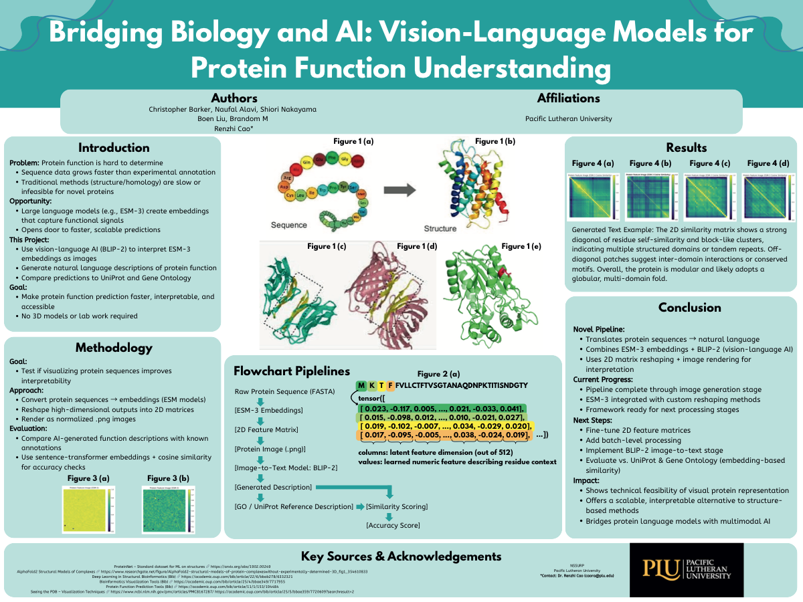
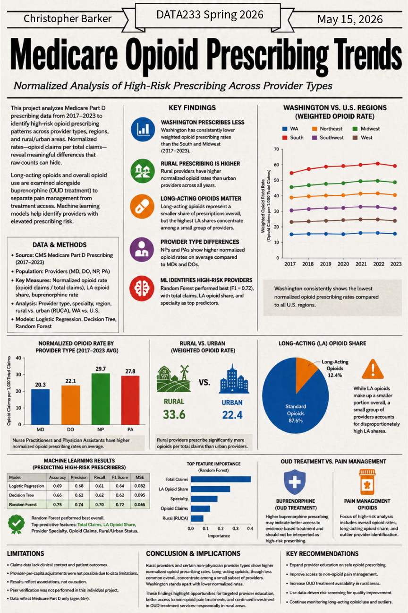
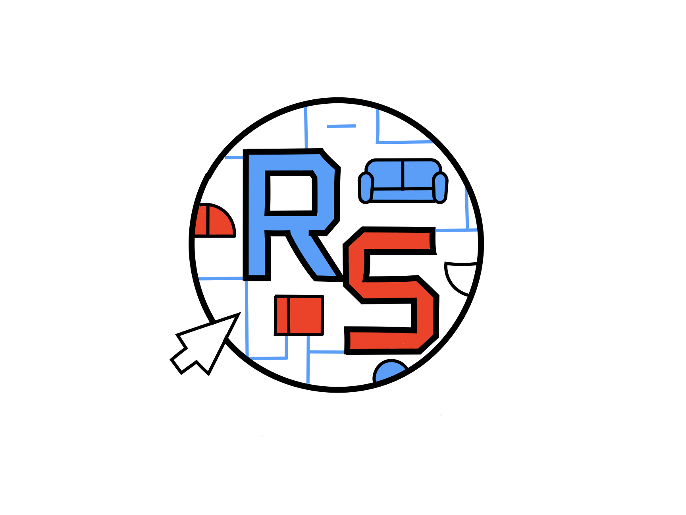

# Thumbnail Curation Architecture: Project-Aware Focal Positioning

## Overview

This document defines the **intentional thumbnail system** where each featured project has:
- **Intentional hero visual** (the strongest implementation moment)
- **Intentional focal crop** (where the visual proof-point lives)
- **Intentional focal positioning** (object-position CSS anchor)
- **Recruiter-facing composition** (visual hierarchy, not document preview scaling)

**Goal**: Replace generic `object-fit: cover; object-position: center;` with project-specific `object-position` values that highlight implementation strength and remove whitespace.

---

## Featured Project Audit & Focal Positioning Strategy

### 1. **Protein AI Pipeline** — `protein-ai-pipeline`
**Current Issue**:
- Source: `images/thumbnails/bridging-biology-and-ai-understanding.png`
- Status: Research poster/diagram export
- Problem: Full poster centered → excessive whitespace above/below content

**Recruiter-Facing Proof-Point**:
- Pipeline architecture diagram
- Method callouts and flow visualization
- Research context (ESM-3 embeddings, BLIP-2, GO similarity)

**Focal Position**:
- **Content Region**: Central pipeline diagram (typically 20–70% vertical)
- **Recommended**: `object-position: center 35%;`
- **Rationale**: Center horizontally; shift focus to middle pipeline tier, not top title/margin

**CSS Class**: `.protein-ai-thumb`

---

### 2. **Opioid Prescribing Risk Analysis** — `opioid-prescribing-risk-analysis`
**Current Issue**:
- Source: `images/opioid-prescribing-risk-poster.PNG` (864×1296 px, narrow poster)
- Status: Data analysis poster
- Problem: Full poster crops awkwardly; charts clipped or sidelined

**Recruiter-Facing Proof-Point**:
- ML model performance charts
- Geographic provider distribution maps
- Risk score visualizations
- Healthcare data interpretation

**Focal Position**:
- **Content Region**: Charts occupy upper-to-middle (0–60% vertical)
- **Recommended**: `object-position: center 25%;`
- **Rationale**: Anchor to chart cluster; avoid title block and bottom whitespace

**CSS Class**: `.opioid-thumb`

---

### 3. **Grocery Retail Consumer Analytics** — `grocery-retail-consumer-analytics`
**Current Issue**:
- Source: `images/grocery-retail-consumer-poster.png` (3300×5100 px, extremely tall poster)
- Status: Analytics dashboard poster
- Problem: Full poster scales down → visualizations become unreadable; dead space dominates

**Recruiter-Facing Proof-Point**:
- Dashboard layout and data visualization design
- Consumer analytics charts
- Retail insights synthesis
- Visual information hierarchy

**Focal Position**:
- **Content Region**: Dashboard and charts (roughly 30–70% of vertical space)
- **Recommended**: `object-position: center 45%;`
- **Rationale**: Shift down from title → focus on actual dashboard content and charts

**CSS Class**: `.grocery-thumb`

---

### 4. **Minesweeper Game** — `minesweeper-game`
**Current Issue**:
- Source: CSS fallback visual (game-thumb with mine-visual grid)
- Status: Fallback (no PNG export)
- Problem: Abstract game board visual lacks gameplay context

**Recruiter-Facing Proof-Point**:
- Playable game state (tiles, flags, numbers)
- Interactive UI proof
- JavaScript game logic visualization

**Focal Position**:
- **Content Region**: Game board itself (typically center-focused)
- **Recommended**: `object-position: center center;` (keep centered, but consider gameplay screenshot export)
- **Notes**: Priority for gameplay screenshot export; CSS visual is placeholder only

**CSS Class**: `.game-thumb` (existing)

---

### 5. **Battleship Game** — `battleship-game`
**Current Issue**:
- Source: CSS fallback visual (game-thumb with battle-visual board)
- Status: Fallback (no PNG export)
- Problem: Abstract game state visual lacks interaction context

**Recruiter-Facing Proof-Point**:
- Game board state (ships, hits, misses)
- Strategic gameplay visualization
- Java OOP implementation proof

**Focal Position**:
- **Content Region**: Game board grid (center-focused)
- **Recommended**: `object-position: center center;` (keep centered)
- **Notes**: Consider gameplay screenshot export; CSS visual is placeholder

**CSS Class**: `.game-thumb` (existing)

---

### 6. **HTML Resume Portfolio** — `html-resume-portfolio`
**Current Issue**:
- Source: CSS fallback visual (web-thumb with browser-preview)
- Status: Fallback visual (no PNG export)
- Problem: Abstract browser frame lacks implemention context

**Recruiter-Facing Proof-Point**:
- Web layout and responsive design
- Hero section presentation
- Desktop + mobile preview

**Focal Position**:
- **Content Region**: Browser/phone frame content (center)
- **Recommended**: `object-position: center center;` (keep centered)
- **Notes**: Consider exporting live website screenshot; CSS visual is intentional placeholder

**CSS Class**: `.web-thumb` (existing)

---

### 7. **AI Caption Generator** — `ai-caption-generator`
**Current Issue**:
- Source: CSS fallback visual (ai-thumb with caption-app interface)
- Status: Fallback (no PNG export)
- Problem: Abstract interface mockup doesn't show actual UI or results

**Recruiter-Facing Proof-Point**:
- Working app interface screenshot
- Upload flow UI
- Generated caption results panel
- Vibe-based generation proof (interaction pattern visible)

**Focal Position**:
- **Content Region**: Result panel and generated captions (center-to-lower)
- **Recommended**: `object-position: center 55%;` (shift focus to results)
- **Notes**: **HIGH PRIORITY** export: real app screenshot showing upload + results

**CSS Class**: `.ai-caption-thumb`

---

### 8. **GAN Discord Bot** — `gan-discord-bot`
**Current Issue**:
- Source: CSS fallback visual (discord-thumb with bot-message interface)
- Status: Fallback (no PNG export)
- Problem: Abstract Discord frame doesn't show generated images or interaction

**Recruiter-Facing Proof-Point**:
- Discord command interface
- Generated image output
- Bot interaction proof
- AI image generation (actual output)

**Focal Position**:
- **Content Region**: Generated image area (lower-to-center)
- **Recommended**: `object-position: center 60%;` (emphasize generated output)
- **Notes**: **HIGH PRIORITY** export: Discord conversation with bot-generated image visible

**CSS Class**: `.discord-thumb`

---

### 9. **Data Collaboration Room Studio** — `data-collab-room-studio`
**Current Issue**:
- Source: `images/thumbnails/data-collab-room-logo-system.png` (artifact thumbnail)
- Status: Logo/branding system PDF preview
- Problem: Abstract branding visual weak as hero visual

**Recruiter-Facing Proof-Point**:
- Design system artifacts
- Logo variations and usage guidelines
- Studio consultation materials
- Visual identity system

**Focal Position**:
- **Content Region**: Logo/emblem + system guidelines (center)
- **Recommended**: `object-position: center center;` (keep centered for logo emphasis)
- **Notes**: **MEDIUM PRIORITY** export: master logo crop or branding guide page

**CSS Class**: `.branding-thumb`

---

## CSS Implementation Strategy

### Naming Convention
Each featured project gets a **project-specific focal positioning class**:

```css
.thumb.protein-ai-thumb { object-position: center 35%; }
.thumb.opioid-thumb { object-position: center 25%; }
.thumb.grocery-thumb { object-position: center 45%; }
.thumb.ai-caption-thumb { object-position: center 55%; }
.thumb.discord-thumb { object-position: center 60%; }
.thumb.branding-thumb { object-position: center center; }
```

### HTML Class Application
Minimal HTML changes: add project-specific class to ``:

```html
<!-- Protein AI Pipeline -->


<!-- Opioid Analysis -->


<!-- Grocery Analytics -->


<!-- AI Caption Generator (CSS fallback, will apply when exported) -->
<div class="visual-thumb ai-thumb ai-caption-thumb" ...></div>

<!-- GAN Discord Bot (CSS fallback, will apply when exported) -->
<div class="visual-thumb discord-thumb discord-thumb" ...></div>

<!-- Data Collab Room (already artifact, add class for consistency) -->

```

---

## Architecture Comments (CSS)

```css
/* ─── THUMBNAIL CURATION ARCHITECTURE ───
   Project-aware focal positioning system: each featured project thumbnail
   intentionally crops to highlight strongest implementation moment, not generic
   document preview.
   
   Philosophy: posters, dashboards, diagrams, and UI screenshots are NOT generic
   images to be center-cropped. Each has:
   - Intentional hero visual (proof-point)
   - Intentional focal crop (visual hierarchy)
   - Intentional focal positioning (object-position anchor)
   
   Workflow:
   1. Identify proof-point for each project (chart cluster, pipeline diagram, UI)
   2. Calculate focal region vertical position (% from top)
   3. Apply project-specific object-position class
   4. When hero PNG exports ready, replace CSS fallback with real image
   
   Result: thumbnails read as curated hero moments, not scaled document previews.
*/
```

---

## Priority Export Roadmap

### **Priority 1: Maximum ROI** (Replaces weakest current visuals)
1. **AI Caption Generator** — App screenshot (upload panel + result caption visible)
   - Current: Abstract CSS fallback
   - Impact: Shows working UI, not abstract mockup
   
2. **Protein AI Pipeline** — Pipeline diagram crop (full diagram visible, tight borders)
   - Current: Full poster with excess whitespace
   - Impact: Research proof elevated, whitespace removed

### **Priority 2: High Impact** (Completes visual proof mix)
3. **Opioid Analysis** — Chart cluster crop (ML models + maps visible)
   - Current: Full poster, charts awkwardly positioned
   - Impact: Data visualization proof, recruiter-facing

4. **Grocery Analytics** — Dashboard crop (consumer analytics visible)
   - Current: Extremely tall poster, unreadable at thumbnail scale
   - Impact: Analytics visualization, visual hierarchy

5. **GAN Discord Bot** — Bot interaction with generated image
   - Current: Abstract CSS fallback
   - Impact: AI output proof, bot interaction pattern visible

### **Priority 3: Supporting** (Refinement)
6. **Minesweeper Gameplay** — Actual gameplay screenshot (tiles, flags, numbers)
   - Current: CSS game board (adequate but abstract)
   - Impact: Interaction proof, gameplay context

7. **Derailed** — Gameplay screenshot (if future export available)
   - Current: Not in featured reel yet
   - Impact: Game dev portfolio proof

---

## Verification Checklist

When exports are placed in `images/thumbnails/`:

- [ ] Each featured project thumbnail displays as hero visual (not scaled document)
- [ ] Focal positioning removes excessive whitespace
- [ ] Recruiter-facing proof-point is prominently positioned
- [ ] Visual hierarchy is clear (no clipped or sidelined content)
- [ ] Aspect ratio maintains 3:2 hero crop (1600×1067 recommended, 260px displayed)
- [ ] CSS fallback visuals still render correctly for projects awaiting export
- [ ] Hover effect still functions (transform applied correctly)
- [ ] Responsive behavior maintained (mobile 680px, tablet 560px breakpoints)

---

## Maintenance Guidelines

### When Updating a Featured Project Thumbnail:
1. **Identify the proof-point**: What implementation moment matters most?
2. **Calculate focal position**: What vertical % region contains the strongest visual?
3. **Apply class to HTML**: Add project-specific class to `` or `<div>`
4. **Export hero crop**: 1600×1067 px (3:2, 260px display height)
5. **Place in images/thumbnails/**: Use canonical filename from `thumbnail-map.json`
6. **Update thumbnail-map.json**: Atomic commit with image + map together

### Example: Updating Grocery Analytics
```
1. Current: Full 3300×5100 px poster, unreadable at thumbnail scale
2. Proof-point: Dashboard layout + consumer analytics charts
3. Hero region: 30–70% vertical (skip title, focus on charts)
4. Focal position: center 45% (shift from title downward)
5. Export: Crop dashboard + chart region, resize to 1600×1067
6. Deploy: images/thumbnails/grocery-hero.png + update JSON
```

---

## System Benefits

**For Recruiters**:
- ✅ Curated hero moments (strongest evidence immediately visible)
- ✅ No wasted whitespace (focus on implementation, not document margins)
- ✅ Clear visual hierarchy (focal region is intentional, not random)
- ✅ Proof-points prominent (UI, charts, diagrams, gameplay visible)

**For Maintainability**:
- ✅ Systematic focal positioning (not ad-hoc CSS tweaks)
- ✅ Project-specific classes (clear intent, easy to update)
- ✅ CSS-fallback graceful (abstract visuals hold position during export phase)
- ✅ Atomic deployment (never update JSON before files exist)

**For Future Updates**:
- ✅ Clear naming convention (protein-ai-thumb, opioid-thumb, etc.)
- ✅ Documented crop strategy (proof-point + focal region defined)
- ✅ Export workflow preserved (images/thumbnails/ → update JSON → deploy)

---

## Appendix: Current Thumbnail Status

| Project | Current Source | Status | Focal Position | Next Action |
|---------|----------------|--------|-----------------|-------------|
| Protein AI | bridging-biology-and-ai-understanding.png | artifact | center 35% | Monitor |
| Opioid | opioid-prescribing-risk-poster.PNG | artifact | center 25% | Crop dashboard |
| Grocery | grocery-retail-consumer-poster.png | artifact | center 45% | Crop dashboard |
| Minesweeper | CSS (game-thumb) | fallback | center center | Optional gameplay screenshot |
| Battleship | CSS (game-thumb) | fallback | center center | Optional gameplay screenshot |
| HTML Resume | CSS (web-thumb) | fallback | center center | Hold (portfolio piece) |
| AI Caption | CSS (ai-thumb) | fallback | center 55% | **PRIORITY 1** → App screenshot |
| GAN Bot | CSS (discord-thumb) | fallback | center 60% | **PRIORITY 1** → Bot interaction screenshot |
| Data Collab | data-collab-room-logo-system.png | artifact | center center | Monitor |

---

## References

- `thumbnail-map.json` — Asset routing and status tracking
- `thumbnail-map-doc.md` — Complete export workflow + verification steps
- `css/styles.css` — `.thumb`, `.visual-thumb`, project-specific focal classes
- `projects.html` — Featured project card HTML structure
