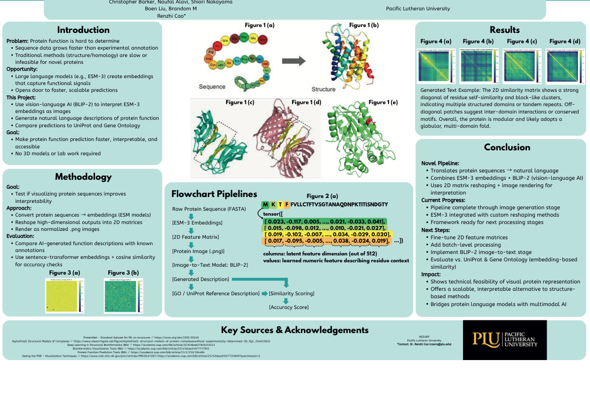

# Thumbnail Mapping System Documentation

## Overview

The portfolio uses a **two-tier visual fallback system** to handle thumbnail exports and maintain visual consistency across the reel. This document explains the system, provides the complete asset export workflow, and ensures maintainability for future iterations.

### Key Principle

**Never update `thumbnail-map.json` before hero PNG files exist.** The JSON is the source-of-truth for asset routing; premature updates cause placeholder drift and broken links.

---

## System Architecture

### Tier 1: Hero PNG Exports (Primary)

Real images exported from source projects and placed in `images/thumbnails/` directory.

- **Location**: `images/thumbnails/*.png`
- **Dimensions**: 1600×1067 px base (3:2 aspect ratio); optional retina @2x (3200×2134 px)
- **Content**: Tight crops of strongest project moments
  - Gameplay screenshots (visual energy)
  - Dashboard/chart results (analytical proof)
  - UI screenshots (product polish)
  - Design system artifacts (process evidence)
- **Status in JSON**: `"status": "artifact"` (real export) or `"derived"` (composite/edited)

### Tier 2: CSS Fallback Visuals (Temporary)

Generated CSS gradients + patterns for design/data/code projects while awaiting PNG exports.

- **Implementation**: `.visual-thumb` divs with themed gradient + pattern
- **Types**:
  - `.ai-thumb`: Radial gradients + accent colors (suggests algorithm/ML)
  - `.design-thumb`: Grid pattern + accent borders (suggests layout/system)
  - `.data-thumb`: Horizontal bar chart visual (suggests analytics/results)
  - `.code-thumb`: Code lines pattern (suggests development)
  - `.creative-thumb`: Organic gradient + texture (suggests media/design)
- **Transition**: Replace with `.thumb` (real ``) as PNG exports complete
- **Status in JSON**: `"status": "fallback"` (CSS-generated visual)

### Routing Logic

For each featured project:

```html
<!-- If PNG exists in images/thumbnails/: -->


<!-- If PNG not ready: fallback to CSS visual -->
<div class="visual-thumb ai-thumb"><!-- no content needed; styles handle visual --></div>
```

The `thumbnail-map.json` tracks this state per project, enabling atomic updates.

---

## File Structure

```
portfolio-site/
├── images/
│   └── thumbnails/
│       ├── protein-ai-pipeline-hero.png          (1600×1067 px)
│       ├── derailed-gameplay-hero.png
│       ├── sidiya-branding-system-hero.png
│       ├── grocery-retail-consumer-analytics-hero.png
│       ├── opioid-prescribing-risk-hero.png
│       ├── ai-caption-generator-hero.png
│       └── ...
├── thumbnail-map.json                             (source-of-truth)
├── thumbnail-replacements.md                      (export prioritization)
├── thumbnail-export-checklist.md                  (export workflow)
├── thumbnail-map-proposal.md                      (ready-to-apply patch)
├── thumbnail-map-doc.md                           (this file)
├── index.html                                     (featured reel)
├── projects.html                                  (featured + supporting reels)
└── css/styles.css                                 (visual system)
```

---

## Export Workflow

### Priority 1: Highest ROI (Deploy First)

These replacements have immediate visual impact on recruiter perception.

```bash
# 1. SiDiYa Branding System (highest priority)
#    From: assets/featured/sidiya-branding-system-hero/ (design artifacts)
#    Extract: Master board crop (visual mark + system overview)
#    Dimensions: 1600×1067 px (3:2)
#    Alt text: "SiDiYa branding system master board with emblem, color palette, and typeface exploration"

convert assets/featured/sidiya-branding-system-hero/master-board.png \
  -resize 1600x1067\! \
  -quality 82 \
  images/thumbnails/sidiya-branding-system-hero.png

# 2. Protein AI Pipeline (second priority)
#    From: assets/featured/ai-caption-generator/ (project assets)
#    Extract: Pipeline diagram crop showing neural architecture or model flow
#    Dimensions: 1600×1067 px (3:2)
#    Alt text: "Protein AI pipeline diagram showing neural network architecture for molecular property prediction"

convert assets/featured/ai-caption-generator/pipeline-diagram.png \
  -resize 1600x1067\! \
  -quality 82 \
  images/thumbnails/protein-ai-pipeline-hero.png

# 3. Grocery Retail Analytics (third priority)
#    From: assets/grocery/ (analysis results)
#    Extract: Key dashboard visualization or chart result
#    Dimensions: 1600×1067 px (3:2)
#    Alt text: "Grocery retail consumer analytics dashboard showing sales trends and category performance"

convert assets/grocery/analysis.html \
  -resize 1600x1067\! \
  -quality 82 \
  images/thumbnails/grocery-retail-consumer-analytics-hero.png
```

### Priority 2: Secondary Visual Improvements

Addresses "full poster" visual problem with tight crops.

```bash
# 4. Opioid Prescribing Risk Analysis (chart/result focus)
#    From: assets/opioid/Project2.ipynb (analysis results)
#    Extract: ML model results chart or prediction visualization
#    Dimensions: 1600×1067 px (3:2)
#    Alt text: "Opioid prescribing risk analysis showing ML model results and regional patterns"

convert assets/opioid/model_results.csv \
  -resize 1600x1067\! \
  -quality 82 \
  images/thumbnails/opioid-prescribing-risk-hero.png

# 5. AI Caption Generator (app UI focus)
#    From: assets/ai-caption/vibe_caption_generator.py (app interface)
#    Extract: App UI screenshot or interface mockup
#    Dimensions: 1600×1067 px (3:2)
#    Alt text: "AI caption generator app interface for generating creative image descriptions with vibe analysis"

convert assets/ai-caption/app-ui-screenshot.png \
  -resize 1600x1067\! \
  -quality 82 \
  images/thumbnails/ai-caption-generator-hero.png
```

### Priority 3: Missing Proof-Points

Adds critical gameplay/interaction screenshots.

```bash
# 6. Derailed Multiplayer Gameplay (missing visual)
#    From: source project archive (not in current portfolio)
#    Extract: Multiplayer gameplay screenshot showing interaction/UI
#    Dimensions: 1600×1067 px (3:2)
#    Alt text: "Derailed multiplayer strategy game showing real-time gameplay and interactive board state"
#    NOTE: May require source project recovery or documentation of historical gameplay screenshots

convert archived-derailed-screenshots/multiplayer-board.png \
  -resize 1600x1067\! \
  -quality 82 \
  images/thumbnails/derailed-gameplay-hero.png
```

### Optional: Retina Exports (@2x)

For future high-DPI optimization, export 2x versions:

```bash
# Generate retina @2x versions (optional; adds ~2–4 MB total)
for file in images/thumbnails/*.png; do
  convert "$file" \
    -resize 3200x2134\! \
    -quality 82 \
    "${file%.png}@2x.png"
done
```

---

## Verification & Deployment

### Pre-Deployment Checklist

Before committing, verify:

```bash
# 1. All target PNG files exist in images/thumbnails/
ls -la images/thumbnails/*.png
# Expected output: 6 files for priority 1–2, plus optional @2x files

# 2. Verify file sizes are reasonable (8–15 KB per PNG)
du -sh images/thumbnails/*.png
# If any file is >20 KB, re-compress with higher -quality threshold

# 3. Quick visual inspection: open a few in browser/preview
open images/thumbnails/sidiya-branding-system-hero.png
open images/thumbnails/protein-ai-pipeline-hero.png

# 4. Validate thumbnail-map.json syntax
python3 -m json.tool thumbnail-map.json > /dev/null && echo "Valid JSON"

# 5. Test reel rendering locally
# Open index.html in browser; verify all featured project cards display correctly
# Check for broken images (red X) or CSS fallback visuals still appearing
```

### Atomic Deployment

Update `thumbnail-map.json` and deploy as single commit:

```bash
# 1. Ensure all PNG files are placed in images/thumbnails/
ls -la images/thumbnails/

# 2. Update thumbnail-map.json with new entries (use thumbnail-map-proposal.md as guide)
# CRITICAL: only update after files are verified to exist above

# 3. Stage files + JSON atomically
git add images/thumbnails/*.png thumbnail-map.json

# 4. Single atomic commit
git commit -m "Add hero thumbnails for featured reel and update thumbnail-map"

# 5. Push to deployable repo
git push origin main

# 6. Verify deployment
# Open portfolio site live: https://christopherdsbarker.github.io/webpage/
# Test featured reel rendering with new images
```

### Rollback Strategy

If deployment breaks (images missing, JSON error, etc.):

```bash
# 1. Identify the bad commit
git log --oneline | head

# 2. Revert to previous good state
git revert <commit-hash>
git push origin main

# 3. Investigate: check images/thumbnails/ locally, validate JSON, retry
```

---

## Integration with HTML Pages

### Featured Reel (index.html)

Featured projects display hero PNGs via `.project-grid` reel:

```html
<div class="project-grid" data-reel="featured">
  <a href="featured/protein-ai-pipeline.html" class="project-card">
    <!-- Tier 1: Real image -->
    
    <!-- If image fails to load, CSS fallback activates (.thumb::after) -->
  </a>
  
  <!-- Or: CSS fallback for projects awaiting PNG export -->
  <a href="featured/sidiya-branding-system.html" class="project-card">
    <div class="visual-thumb design-thumb">
      <!-- Grid pattern + accent colors generated by CSS -->
    </div>
  </a>
</div>
```

### Featured Reel (projects.html)

Same system repeated for full `projects.html` featured reel section.

### Fallback Cascade

If PNG doesn't exist, browser automatically displays CSS fallback:

1. **Attempted**: ``
2. **If missing**: CSS `.thumb` background shows, then `.visual-thumb` fallback renders if JS strips broken ``
3. **User sees**: Design-system CSS visual instead of broken image

---

## CSS Architecture

### Thumbnail System Styles (css/styles.css)

```css
/* Real image: PNG from images/thumbnails/ */
.thumb {
  width: 100%;
  height: 260px;
  object-fit: cover;
  object-position: center;
  background: var(--navy-2);
  transition: transform 180ms ease;
}

/* CSS fallback visual for design/data/code awaiting PNG export */
.visual-thumb {
  width: 100%;
  height: 260px;
  padding: 8px;
  display: grid;
  place-items: center;
  background: linear-gradient(135deg, rgba(5, 7, 12, 0.98), rgba(16, 26, 47, 0.94)), var(--navy);
  transition: transform 180ms ease;
}

/* Type-specific fallback visuals */
.visual-thumb.ai-thumb { /* radial + algorithm suggestion */ }
.visual-thumb.design-thumb { /* grid + layout suggestion */ }
.visual-thumb.data-thumb { /* bars + analytics suggestion */ }
.visual-thumb.code-thumb { /* lines + development suggestion */ }
.visual-thumb.creative-thumb { /* organic + media suggestion */ }
```

### Featured Reel Context

Featured projects display with:
- **Height**: 260px (prominent, recruiter-facing)
- **Aspect**: 3:2 (1600×1067 px base)
- **Gap**: 10px (tight spacing for visual density)
- **Reel animation**: Horizontal scroll snap (mobile-friendly)

Supporting projects display with:
- **Height**: 204px (secondary, less visual weight)
- **Aspect**: 3:2 (same ratio, smaller absolute size)
- **Gap**: 12px (slightly looser for secondary category)

---

## JSON Structure Reference

### Single Project Entry

```json
{
  "protein-ai-pipeline": {
    "displayName": "Protein AI Pipeline",
    "category": "Featured",
    "thumbnailPath": "images/thumbnails/protein-ai-pipeline-hero.png",
    "sourceAsset": "assets/featured/ai-caption-generator/pipeline-diagram.png",
    "status": "artifact",
    "dimensions": "1600×1067",
    "fallbackVisual": "ai-thumb",
    "nextBestAsset": "assets/featured/ai-caption-generator/process-screenshot.png"
  }
}
```

### Status Values

- `"artifact"`: Real PNG export from project source
- `"derived"`: Composite or edited PNG (e.g., cropped, color-adjusted)
- `"fallback"`: CSS-generated visual (temporary, pending PNG export)
- `"placeholder"`: Hardcoded color fill (minimal visual investment)

### Fallback Visual Types

- `"ai-thumb"`: Radial gradients + ML color palette
- `"design-thumb"`: Grid pattern + accent borders
- `"data-thumb"`: Horizontal bar chart visual
- `"code-thumb"`: Code line pattern
- `"creative-thumb"`: Organic gradient
- `"none"`: No CSS fallback (e.g., real images always available)

---

## Maintenance & Future Iterations

### Quarterly Review

Every 3–4 months, audit featured reel:

```bash
# 1. Check for stale fallback visuals (CSS-generated; should be 0 for featured)
grep '"fallback"' thumbnail-map.json | wc -l
# Expected: 0 (all featured should be "artifact")

# 2. Spot-check PNG quality and relevance
ls -la images/thumbnails/ | sort -k5 -rn
# Review file sizes; if >20 KB, consider re-compression

# 3. Test reel rendering across devices
# Mobile: ensure snap alignment works
# Desktop: ensure scroll behavior is smooth
# Tablet: verify responsive breakpoints

# 4. Update supporting reel with new projects
# Add new design/data/code entries to supporting section
# Use CSS fallback visual until PNG export ready
```

### Asset Refresh Strategy

When project changes or visual updates needed:

```bash
# 1. Export new PNG from updated project
# Follow dimensions: 1600×1067 px (3:2 aspect)

# 2. Place in images/thumbnails/ with existing naming convention
# Example: protein-ai-pipeline-hero.png (keep same filename)

# 3. Update thumbnail-map.json entry
# Bump version, update "sourceAsset", keep filename the same

# 4. Single atomic commit
git add images/thumbnails/protein-ai-pipeline-hero.png thumbnail-map.json
git commit -m "Update protein AI pipeline hero with new diagram export"
git push origin main
```

### Documentation Updates

When changing this workflow, update:

1. `thumbnail-replacements.md` — If export priorities change
2. `thumbnail-export-checklist.md` — If ImageMagick commands change
3. `thumbnail-map-doc.md` — This file (instructions, JSON structure, status values)
4. Architectural comments in `css/styles.css` — If visual system changes
5. `README.md` — If high-level governance changes

---

## Quick Reference

### "I just added a new PNG export. How do I deploy?"

1. Verify file exists: `ls images/thumbnails/new-project-hero.png`
2. Check dimensions: `identify images/thumbnails/new-project-hero.png` (should be 1600×1067 or close)
3. Update `thumbnail-map.json` with new entry or modify existing
4. Stage + commit + push:
   ```bash
   git add images/thumbnails/new-project-hero.png thumbnail-map.json
   git commit -m "Add hero thumbnail for new project"
   git push origin main
   ```

### "I want to replace the CSS fallback visual. What do I do?"

1. Export PNG from project source (1600×1067 px, 3:2 aspect)
2. Place in `images/thumbnails/` with project-slug naming
3. Change HTML from `<div class="visual-thumb ai-thumb">` to ``
4. Update `thumbnail-map.json` status to `"artifact"`
5. Deploy atomically

### "The featured reel looks wrong. What's the priority?"

1. Check `images/thumbnails/` — do all PNG files exist?
2. Open browser DevTools → Elements → inspect `.project-card` elements
3. If `.visual-thumb` showing (not `.thumb`), PNG path is wrong or file missing
4. If `.thumb` showing broken (red X), check filename against `thumbnail-map.json`
5. If all images present but styling looks off, review `css/styles.css` `.project-grid` and `.thumb` values

---

## Related Files

- **`thumbnail-map.json`** — Source-of-truth asset routing (ONLY update after PNG files verified)
- **`thumbnail-replacements.md`** — Export prioritization with exact filenames and specs
- **`thumbnail-export-checklist.md`** — ImageMagick commands and deployment workflow
- **`thumbnail-map-proposal.md`** — Ready-to-apply JSON patch (review before merging)
- **`css/styles.css`** — Visual system (`.project-grid`, `.thumb`, `.visual-thumb` implementation)
- **`index.html` & `projects.html`** — HTML reel rendering (featured + supporting)

---

## Archive & Historical Context

This system evolved from:
1. **Asset-driven reel** (display whatever files exist)
   → **Curator-driven reel** (display strongest visual moments, substitute fallbacks if needed)

2. **Full poster previews** (100% document coverage)
   → **Hero crop moments** (tight 3:2 highlights, gameplay/results/UI focus)

3. **Placeholder visuals** (solid colors, no design system)
   → **CSS fallback system** (themed gradients + patterns, suggests project type)

The shift from engineering-constrained to curation-constrained means visual selection now drives recruiter perception more than code architecture.

---

**Last Updated**: Current session  
**Maintainer**: Portfolio curation system  
**Questions?** See `thumbnail-replacements.md`, `thumbnail-export-checklist.md`, or architectural comments in `css/styles.css`
